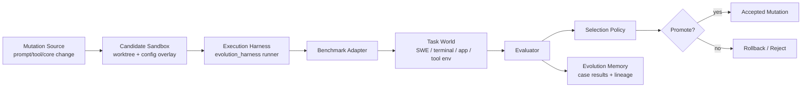

# Evolution Environment Integration Design v1

**Status:** Draft  
**Date:** 2026-05-14  
**Author:** Codex  

## Goal

Build a stable, repeatable, and selective evolution environment around Vibelution so self-modification is judged by survival in task environments rather than by internal narration alone.

The target state is:

- candidate mutations run in isolated sandboxes
- each candidate is evaluated against stable external tasks
- successful mutations are promoted
- failed mutations are rolled back automatically
- cross-generation results become structured evolution memory

This document focuses on how to connect Vibelution to external benchmark ecosystems such as:

- `Terminal-Bench`
- `SWE-bench Verified`
- `tau-bench`
- `AppWorld`
- later: `SWE-bench-Live`, `SWE-rebench`, `WebArena Verified`, `OSWorld`

## Current State

Vibelution already has several strong building blocks:

1. `scripts/evolution_harness.py`
   - creates checkpoint snapshots
   - runs the agent in temporary worktrees
   - observes restart and post-restart behavior
   - emits structured reports

2. `core/infrastructure/evolution_governor.py`
   - enforces mutation boundaries during active evolution transactions
   - records mutation and validation audit events
   - builds a lightweight internal fitness summary

3. `core/infrastructure/test_gate.py`
   - blocks propagation when environment smoke or tests fail

4. `agent.py`
   - already supports `single_turn`, `auto`, and test-style execution entrypoints

5. `workspace/` and SQLite state
   - already provide a place for identity, long-term memory, task logs, and error archives

These pieces mean Vibelution already has an internal evolution sandbox.

What it does **not** yet have is a general environment layer that can plug in real outside task worlds and compare candidate mutations against a baseline.

## Problem Statement

The current system mainly answers:

- did the mutation stay within boundaries?
- did local validation pass?
- did the transaction close cleanly?

It does **not** yet reliably answer:

- did the mutation make the agent stronger in an external task world?
- stronger than what baseline?
- stronger on which class of tasks?
- at what complexity cost?
- should this mutation be retained across generations?

Without that layer, self-evolution remains closer to controlled self-editing than to environment-driven selection.

## Design Principles

The integration should follow these principles:

1. External environments are adapters, not special cases in `agent.py`.
2. The existing `evolution_harness` should become the common execution shell.
3. Selection should be comparative: `baseline` versus `candidate`.
4. Internal gates remain necessary but become inner safety layers, not final judgment.
5. Environment results must be persisted as structured evolution memory.
6. New environment support should not require changing the agent core loop.

## Architecture Overview



## Proposed New Layers

### 1. Benchmark Adapter Layer

Create a new package:

`core/evaluation/`

Suggested modules:

- `benchmark_adapter.py`
- `benchmark_registry.py`
- `case_models.py`
- `selection_policy.py`
- `result_store.py`
- `environment_profiles.py`

Each benchmark integration should implement the same adapter contract.

Suggested interface:

```python
class BenchmarkAdapter:
    name: str

    def prepare_case(self, case_id: str, sandbox_root: Path) -> PreparedCase: ...
    def build_agent_prompt(self, prepared: PreparedCase) -> str: ...
    def build_runtime_config(self, prepared: PreparedCase) -> dict: ...
    def run_evaluation(self, prepared: PreparedCase, harness: HarnessRunner) -> CaseRunResult: ...
    def score_result(self, result: CaseRunResult) -> CaseScore: ...
    def cleanup_case(self, prepared: PreparedCase) -> None: ...
```

This layer should translate external worlds into Vibelution-native runs.

### 2. Comparative Selection Layer

Add a selection step that compares:

- `baseline`
- `candidate`

on the same case bundle.

Selection should not be a single pass/fail bit.

Suggested selection inputs:

- task success rate
- average wall-clock duration
- average tool calls
- validation failures
- restart survival
- mutation complexity cost
- environment-specific score

Suggested rule:

Promote only when the candidate:

- beats or matches baseline on primary score
- does not regress safety gates
- does not exceed a configured complexity budget
- shows improvement above a minimum threshold, not noise

### 3. Environment Fitness Layer

The current internal fitness summary should remain, but it needs a sibling:

- `internal_fitness`: transactions, validations, mutation governance
- `environment_fitness`: task outcomes in benchmark worlds

Suggested storage:

- `workspace/evaluation/runs/`
- `workspace/evaluation/baselines/`
- `workspace/evaluation/leaderboard.jsonl`
- `workspace/evaluation/case_results/<benchmark>/<case_id>.json`

Suggested persisted fields:

- benchmark name
- case id
- baseline version
- candidate version
- success/failure
- score breakdown
- artifacts
- changed files
- elapsed time
- restart count
- post-run validation summary
- promotion decision

### 4. Environment Profiles

Different benchmarks need different runtime assumptions.

Introduce profiles such as:

- `terminal_local`
- `swe_verified_container`
- `tool_dialogue`
- `appworld_local`
- `live_external_readonly`

Each profile should define:

- sandbox type
- network policy
- timeout budget
- allowed mutation directories
- allowed tool classes
- required artifacts
- evaluation command

This should live outside `agent.py` and be resolved by the evaluation layer.

## Role of Existing Components

### `scripts/evolution_harness.py`

This should become the common runner for both:

- internal probes
- benchmark cases

Recommended change:

- keep existing `scenario` support
- add a benchmark execution mode that accepts structured case input
- reuse worktree, process observation, restart observation, and report writing

This is the lowest-risk path because the harness already solves the hardest runtime isolation problems.

### `EvolutionGovernor`

Keep it as the mutation boundary and internal audit authority.

Recommended extension:

- record benchmark case metadata in audit records
- record candidate versus baseline identifiers
- record complexity budget deltas

Do **not** turn it into the benchmark adapter itself. It should remain a governor, not become a world simulator.

### `test_gate.py`

Keep the current gates as inner safety checks.

Recommended role after integration:

- block obviously broken candidates before expensive environment runs
- run post-case safety checks before promotion

The benchmark environment should become the outer selection layer, not replace safety gates.

## Evaluation Ecology

Vibelution should not rely on one benchmark only.

Use a three-layer ecology.

### Layer A: Inner Safety Ecology

Purpose:

- prevent self-destruction
- verify protocol and environment invariants

Sources:

- current `pytest`
- environment smoke
- prompt debugger
- internal harness probes

Run frequency:

- every candidate mutation

### Layer B: Stable Selection Ecology

Purpose:

- provide repeatable selection pressure
- compare baseline and candidate under controlled conditions

Initial sources:

- `Terminal-Bench`
- small curated subset of `SWE-bench Verified`
- `tau-bench` starter subset

Run frequency:

- every candidate promotion attempt

### Layer C: Fresh External Ecology

Purpose:

- detect overfitting to static tasks
- ensure retained organs generalize

Later sources:

- `SWE-bench-Live`
- `SWE-rebench`
- rotating fresh case packs

Run frequency:

- periodic, not every mutation
- e.g. daily, weekly, or before major promotion

## Recommended Integration Order

### Phase 1: Terminal-Bench First

Why first:

- closest to current harness model
- leverages existing shell and process observation structure
- lower environment complexity than repo-level patch benchmarks

Target outcome:

- prove that Vibelution can survive and improve in terminal task environments

### Phase 2: SWE-bench Verified Subset

Why second:

- directly tests software-engineering fitness
- closer to the long-term self-improvement goal

Constraints:

- better suited to Linux container or WSL execution than the current Windows host
- should be integrated through an environment profile, not special-case scripts

Target outcome:

- evaluate whether candidate mutations improve real repo-fixing performance

### Phase 3: tau-bench

Why third:

- tests tool-use organs and structured multi-turn coordination
- complements code and terminal tasks

Target outcome:

- pressure the system to improve tool selection, dialogue discipline, and task completion under constraints

### Phase 4: AppWorld

Why fourth:

- richer world model
- stronger test of stateful planning and environment interaction
- more costly to integrate and score

Target outcome:

- grow more general task-world organs once basic evaluation plumbing is stable

## Proposed Directory Layout

```text
core/
  evaluation/
    __init__.py
    benchmark_adapter.py
    benchmark_registry.py
    case_models.py
    selection_policy.py
    result_store.py
    environment_profiles.py
    adapters/
      __init__.py
      terminal_bench.py
      swe_bench_verified.py
      tau_bench.py
      appworld.py

scripts/
  benchmark_harness.py

workspace/
  evaluation/
    runs/
    baselines/
    leaderboards/
    case_results/
    environment_cache/
```

## Selection Workflow

Recommended workflow for one promotion attempt:

1. create a mutation candidate
2. run inner safety gates
3. if inner safety fails, reject immediately
4. pick a benchmark bundle from Layer B
5. run baseline on the same bundle
6. run candidate on the same bundle
7. score both results
8. apply selection policy
9. if selected, write promotion record and keep mutation
10. if not selected, roll back candidate and record rejection reason

## Promotion Record Shape

Suggested promotion record fields:

```json
{
  "candidate_id": "mut_20260514_001",
  "baseline_id": "base_20260514",
  "benchmark_bundle": "terminal_core_v1",
  "case_count": 20,
  "primary_score_delta": 0.12,
  "safety_regression": false,
  "complexity_delta": {
    "files_touched": 2,
    "modules_added": 0,
    "prompt_sections_added": 0
  },
  "decision": "promote",
  "reason": "beats baseline without safety regression"
}
```

## Complexity Budget

External environment wins alone should not be enough.

Each mutation should also pay a complexity budget.

Suggested tracked dimensions:

- files touched
- directories touched
- new modules added
- new prompt sections added
- new tools added
- new persistent state keys added
- new cross-module dependencies introduced

Selection policy should penalize changes that improve score only marginally while increasing system burden significantly.

## Required Configuration Changes

Add an evaluation config surface separate from the current `[evolution]` block.

Suggested shape:

```toml
[evaluation]
enabled = true
default_profile = "terminal_local"
result_dir = "workspace/evaluation"
baseline_mode = "same_commit"
promotion_threshold = 0.05
max_case_runtime = 900

[evaluation.layers.inner]
enabled = true

[evaluation.layers.stable]
enabled = true
bundle = "terminal_core_v1"

[evaluation.layers.fresh]
enabled = false
bundle = "swe_live_weekly"
```

Keep `[evolution]` focused on mutation governance and safety, not on external world semantics.

## Risks

### 1. Overfitting to One Benchmark

If Vibelution optimizes only for one world, it may grow brittle organs.

Mitigation:

- keep multiple ecologies
- rotate stable bundles periodically
- use Layer C for freshness checks

### 2. Evaluation Cost Explosion

Repo-level or app-level benchmarks are expensive.

Mitigation:

- use a small stable bundle for most candidate checks
- reserve expensive suites for promotion gates
- cache prepared environments where safe

### 3. Benchmark Coupling Inside the Agent Core

If benchmark logic leaks into `agent.py`, the system will become harder to reason about.

Mitigation:

- keep benchmark semantics in adapters
- keep execution semantics in harness
- keep promotion logic in selection policy

### 4. Unsafe Mutation Scope

Current mutation whitelist is too narrow for real software engineering tasks, but expanding it naively is dangerous.

Mitigation:

- expand allowed roots by profile
- keep high-risk paths proposal-only
- gate wider mutation scope behind explicit environment profiles

## Minimal Viable Integration

The smallest useful first milestone is:

1. create `core/evaluation/`
2. add the `BenchmarkAdapter` contract
3. add one `TerminalBenchAdapter`
4. add `scripts/benchmark_harness.py` that reuses `evolution_harness`
5. persist comparative baseline-versus-candidate results
6. add a simple promotion policy for one stable benchmark bundle

This is enough to move Vibelution from internal probe-driven self-editing toward true environment-shaped evolution.

## Recommended Next Step

After this design, the next implementation plan should focus only on:

- `Phase 1: Terminal-Bench integration`
- no broad benchmark framework generalization beyond what that phase needs

That keeps the first environment organ small, testable, and honest.
