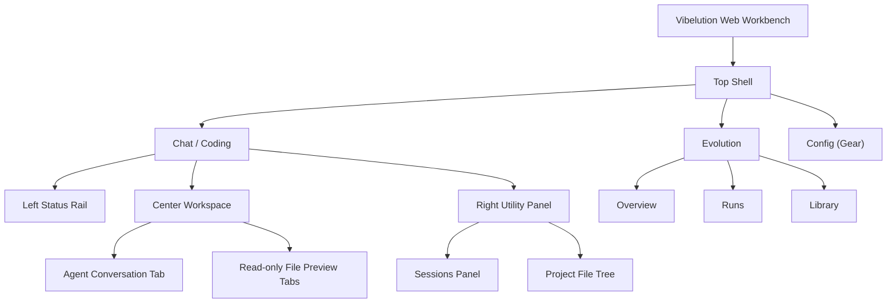

# Vibelution Web Workbench Design

**Goal:** 在保留 CLI 作为开发入口与降级入口的前提下，为 Vibelution 定义一套统一的 Web 工作台设计，承接 `chat/coding` 与 `evolution` 两个主域，并将当前终端 workbench 与独立配置页的分叉体验收束为一个清晰、长期可用的前端壳。

**Primary User:** 项目作者本人，本地长期使用，不考虑登录、多人协作、分享、权限分层。

**Reference Mode:** 行为上参考 Codex Desktop 的对话驱动工作流，但视觉与气质不做冰冷复制。Vibelution 需要更温暖、更稳定、更适合长时间陪伴式工作的本地工作台。

**Design Skill Direction:** 使用 `frontend-design` 的方向约束时，本项目选择的审美基调不是未来感炫技，也不是玩具化宠物界面，而是：

- industrial/utilitarian as the structural base
- warm/companion-like as the emotional accent
- dense, quiet, and reliable as the daily working feel

一句话概括：**安静、可靠、有人味的 agent 工作台。**

---

## 1. Product Intent

### 1.1 This UI is for

1. 持续进行 `Chat / Coding` 工作流
2. 观察 Agent 当前运行状态，而不是盲开黑盒
3. 查看文件内容、理解改动结果，而不是在前端里手工写代码
4. 进入 `Evolution` 域查看运行记录、沉淀可复用内容、调整入库模式
5. 在不离开统一壳的前提下，管理主要使用路径

### 1.2 This UI is not for

1. 登录和权限系统
2. 多人协作空间
3. 通用 IDE 替代品
4. 演示型 landing page
5. 营销型 dashboard

---

## 2. Locked Product Decisions

本轮 BRT 已锁定以下行为，不在后续设计讨论中反复漂移：

1. `Web` 是正式主前端，`CLI` 保留为开发入口、启动入口、降级入口。
2. 顶部主结构只有两个工作域：
   - `Chat / Coding`
   - `Evolution`
3. `Config` 不作为主标签，位于右上角齿轮，进入独立配置页。
4. `Chat / Coding` 默认是首页。
5. `Chat / Coding` 采用三栏结构：
   - 左侧：状态栏
   - 中间：Agent 会话主工作区
   - 右侧：可切换面板
6. 右侧面板只有两类：
   - `会话`
   - `文件树`
7. 右侧文件树打开文件后，中间区以只读标签预览。
8. 人类不在前端里直接编辑文件。
9. AI 允许直接修改工作区文件，行为参考 Codex Desktop。
10. AI 改动后不抢主焦点；用户通过会话说明、文件树标记、主动预览来检查结果。
11. 文件预览标签按会话隔离，切换会话时恢复该会话自己的预览集合。
12. 右侧 `会话` 面板是“会话列表 + 任务状态”的混合型，而不是纯聊天列表。
13. 左侧状态栏是“运行时状态为主，轻陪伴感为辅”的混合型。
14. `Evolution` 域默认进入 `Overview`，并内含：
   - `Runs`
   - `Library`
15. `Library` 入库支持两种模式：
   - 自动模式
   - 手动确认模式
16. 入库模式可在 `Evolution Overview` 快捷切换，也可在 `Config` 完整设置；二者共用同一真实状态。

---

## 3. Information Architecture

### 3.1 Top Shell

顶部不是全局功能全集，而是工作域切换：

- `Chat / Coding`
- `Evolution`
- `Config` 齿轮

顶部的职责是回答：**我现在在哪个工作域里。**

---

## 4. Chat / Coding Domain

### 4.1 Page Purpose

`Chat / Coding` 是日常最高频入口。它不是普通聊天页，而是一个对话驱动的 agent 工作台。

页面首要回答四个问题：

1. Agent 现在在干什么？
2. 我当前在哪条会话里？
3. 我能看哪些文件内容？
4. Agent 刚刚改了什么？

### 4.2 Layout

#### Left Rail: Status

左栏不是导航栏，而是状态栏。建议信息层级：

1. `Agent identity strip`
   - 形象
   - 名称
   - 一句短状态语
2. `Current session summary card`
   - 当前会话标题
   - 当前任务摘要
   - 当前阶段
3. `Runtime status block`
   - 运行状态
   - 当前模式
   - 当前模型
   - 当前配置档
4. `Context and tools block`
   - 上下文占用
   - 活跃工具状态
   - 子任务或 delegation 状态
5. `Recent outcome block`
   - 最近改动文件数
   - 最近一次动作
   - 最近一次成功/失败状态

左栏允许有“当前会话摘要卡”，但不负责切换会话。

#### Center Workspace

中间区是唯一主焦点。它采用标签式工作区，但标签类型只有两类：

1. `Agent Conversation Tab`
2. `Read-only File Preview Tab`

行为规则：

1. `Agent Conversation Tab` 长期存在
2. 从文件树打开文件时，新建或聚焦对应只读预览标签
3. 同一文件不重复开多个预览标签
4. 若 AI 修改了某个已打开预览文件，该标签内容刷新，但不抢焦点
5. 中间区不承担人类编辑器职责

#### Right Utility Panel

右栏是可切换面板，一次只显示一种工具面：

1. `Sessions`
2. `Files`

它负责上下文管理，不负责主工作流输出。

### 4.3 Sessions Panel

右栏 `Sessions` 是“会话列表 + 任务状态”的混合型。

每条会话至少应可见：

1. 会话标题或主题
2. 当前任务状态
   - running
   - waiting
   - done
   - failed
3. 最近活动时间
4. 最近结果摘要

切换行为：

1. 切到某条会话时，中间 `Agent Conversation Tab` 恢复该会话内容
2. 该会话自己的只读预览标签集合一并恢复
3. 上一会话的预览集合不继续占用当前工作区

### 4.4 Files Panel

右栏 `Files` 是项目文件树，不是最近文件流。

职责：

1. 折叠/展开目录
2. 定位项目文件
3. 打开只读预览标签
4. 标记被 AI 修改过的文件

规则：

1. 点开文件后，在中间区打开只读预览标签
2. 当前选中的预览文件可作为 Agent 会话的默认文件上下文
3. 只做查看，不做人类编辑

### 4.5 Agent Change Flow

本项目当前采用接近 Codex Desktop 的变更路径：

1. AI 在会话里说明它将做什么
2. AI 可以直接修改工作区文件
3. 界面不强制进入 diff 审批模式
4. 改动后的可见性通过以下几层保障：
   - 会话消息中的变更说明
   - 会话结果摘要
   - 文件树中的变更标记
   - 用户主动打开的文件预览

关键原则：**改动可见，但不抢焦点。**

---

## 5. Evolution Domain

### 5.1 Page Purpose

`Evolution` 不是聊天历史页，也不是纯跑分页。它是一个服务进化的工作域。

它回答的问题是：

1. 现在整体进化状态如何？
2. 最近几次运行表现怎样？
3. 哪些内容已经沉淀为可复用资产？
4. 当前入库模式是什么？

### 5.2 Internal Structure

`Evolution` 内部采用次级结构：

1. `Overview`
2. `Runs`
3. `Library`

#### Overview

`Overview` 是默认入口，采用混合总览，而不是单一列表。

首屏主次建议：

1. `Current evolution status`
   - 当前是否在跑
   - 当前阶段
   - 最近一次结果
2. `Recent performance change`
   - 最近几次 run 的表现差异
   - 得分趋势
   - 最近失败/回退信号
3. `Recent library additions`
   - 最近入库内容
   - 最近待确认候选

此外，`Overview` 上要有一个显眼但不喧宾夺主的入库模式切换：

- Auto
- Manual Review

#### Runs

`Runs` 是细节页，承载：

1. 每次进化尝试
2. 对应结果
3. 评分
4. 失败原因
5. 输出摘要

#### Library

`Library` 是可复用内容资产页，不是原始运行日志回收站。

应至少区分：

1. 已正式入库内容
2. 待确认候选内容
3. 来源信息
   - 来自哪次 run
   - 自动入库还是人工确认入库

### 5.3 Library Intake Modes

入库模式有两种：

1. `Auto`
2. `Manual Review`

行为约束：

1. `Auto` 下，符合条件的内容直接入库
2. `Manual Review` 下，符合条件的内容先进入候选队列
3. 模式切换只影响后续新内容
4. 已有 Library 条目与既有候选项不追溯改写

模式入口：

1. `Evolution Overview` 上的快捷切换
2. `Config` 页中的完整设置

二者必须共用同一真实状态。

---

## 6. Config Domain

`Config` 保持独立页，不放进顶部主标签，也不做抽屉。

原因：

1. 配置本身信息量大
2. 配置语义是系统级设置，不是工作流级标签
3. 需要和 `Chat / Coding`、`Evolution` 分清主次

`Config` 页后续应继续承接已有 `config_panel` 能力，但在统一 Web 壳中呈现，而不是继续作为单独小系统生长。

---

## 7. Visual Direction

这一部分用于后续进入 `$frontend-design` 真正做页面时保持风格稳定。

### 7.1 Tone

推荐主题名：**Warm Workshop**

关键词：

- quiet
- grounded
- companion-like
- professional
- dense but breathable

### 7.2 Visual Character

不要做：

1. 冰冷赛博蓝紫控制台
2. 夸张 3D 科幻驾驶舱
3. 玩具化宠物 UI
4. 轻飘飘白底 SaaS dashboard

应该做：

1. 深色工作台底
2. 暖色高亮
3. 柔和层级阴影
4. 稍带材质感的背景
5. 紧凑但不拥挤的状态区
6. 稳定、不跳脱的布局骨架

### 7.3 Visual Memory Hook

这个前端应该让人记住的一件事不是“科技感”，而是：

**它像一个会陪你长期干活的本地工作台。**

也就是说，记忆点来自：

1. 左侧温和但克制的 agent 存在感
2. 中间高度专注的工作区
3. 右栏像抽屉一样安静地提供上下文

### 7.4 Typography Direction

后续实现时避免：

- Inter
- Roboto
- Arial

应优先考虑：

1. 一个带性格但不花哨的标题字
2. 一个长时间阅读舒服的正文字

目标不是品牌秀场，而是长时间使用不疲劳。

### 7.5 Motion Direction

动效只用在三类地方：

1. 状态切换
2. 标签切换
3. 右栏面板切换

避免：

1. 大量悬浮动画
2. 炫技式页面加载
3. 到处闪烁的反馈

原则：**少，但准。**

---

## 8. State Model Guidance

后续实现前端时，至少要明确以下状态边界：

### 8.1 Global UI State

1. 当前顶级域：`chat_coding | evolution | config`
2. 当前主题与视觉状态
3. 右栏当前激活面板：`sessions | files`

### 8.2 Chat/Coding Session State

每条会话至少应带：

1. 会话身份信息
2. 任务状态信息
3. 当前默认文件上下文
4. 已打开只读预览标签集合
5. 最近改动文件集合

### 8.3 Evolution State

1. 当前 intake 模式
2. 当前 overview 汇总
3. run 列表与明细
4. library 列表
5. manual review candidate 列表

### 8.4 Single Source Constraints

1. `Overview` 与 `Config` 共享一份 intake mode
2. 文件树变更标记、预览内容、实际磁盘内容必须一致
3. 左栏状态与当前活跃会话/运行阶段必须一致

---

## 9. Acceptance Anchors

后续实现与测试至少要保护以下行为：

1. 进入应用默认落到 `Chat / Coding`
2. 左栏状态与当前活跃会话一致
3. 右栏 `Sessions` 切换后，会话内容与文件预览集合一起恢复
4. 右栏 `Files` 打开文件后，中间区创建只读预览标签
5. AI 修改文件后，不抢当前焦点，但文件树和预览反映真实变更
6. `Evolution` 默认进入 `Overview`
7. `Overview` 的状态、趋势、最近沉淀与 `Runs / Library` 一致
8. `Overview` 和 `Config` 两处 intake mode 开关严格同步

---

## 10. Next Design Tasks

这份设计说明完成后，后续工作顺序建议为：

1. 基于本设计输出 `Chat / Coding` 与 `Evolution` 的低保真结构图
2. 基于 `$frontend-design` 输出视觉 brief 与 token 方向
3. 再决定前端技术栈与实现骨架
4. 最后进入页面实现

在进入实现之前，不应再回到“CLI 还是 Web”“History 到底是什么”这类已锁定问题上反复摇摆。
